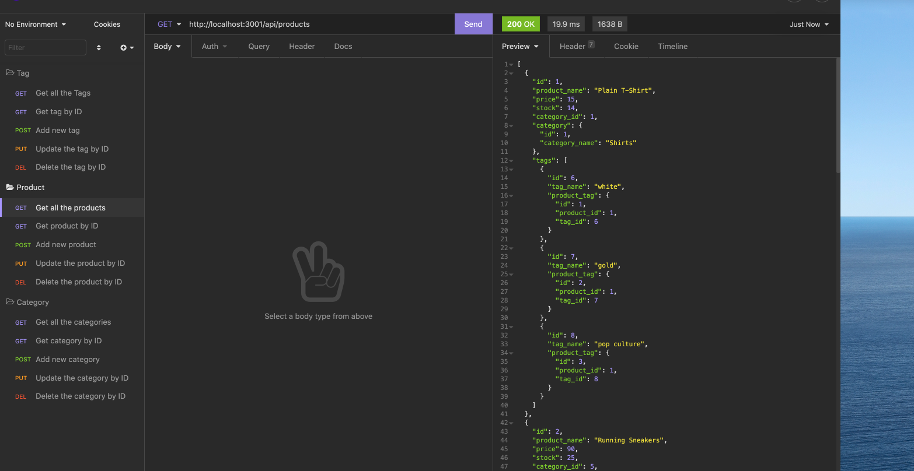
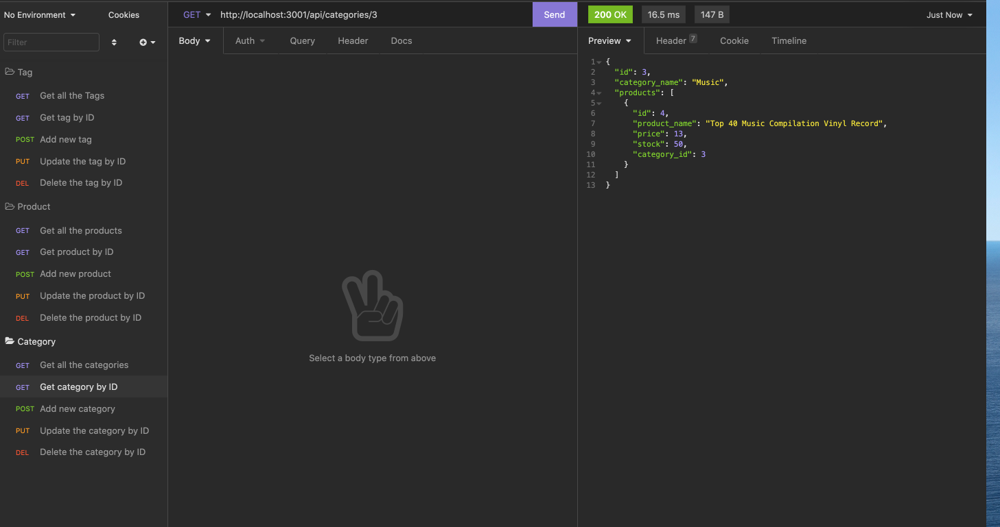
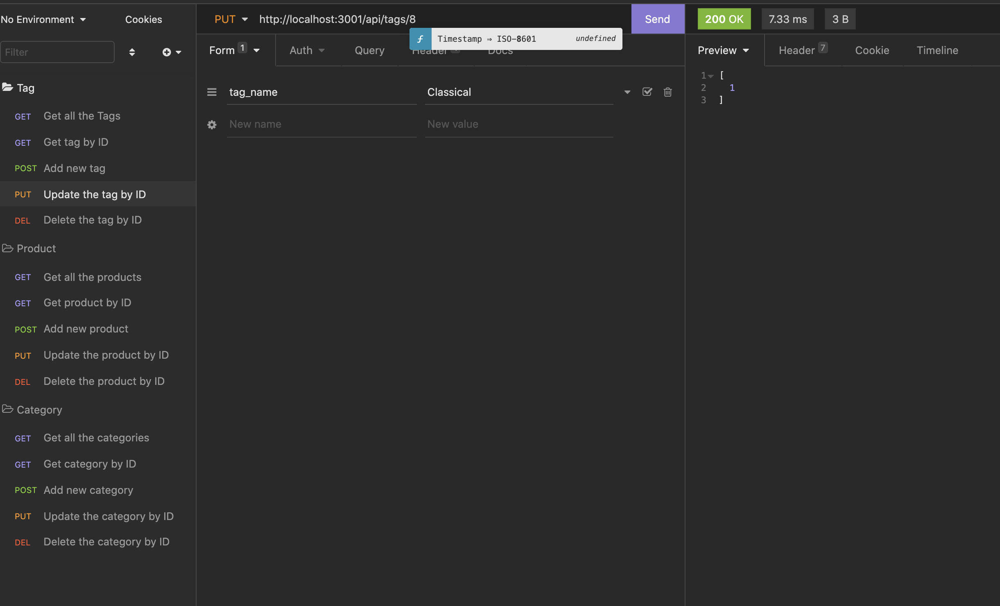

# ecommerce-BE-ORM
Object-Relational Mapping (ORM): E-Commerce Back End

Demonstration video including walkthrough of the functionalities : https://youtu.be/dJV0XzXjZ30

Demo Images: 

## Objectives & Functionalities:

1. To build the backend for an e-commerce site by using MVP, express, mysql2 and sequilize.
2. To setup the username and password, dotenv file is used which is connected to sequelize.
3. To begin with, schema and seed sql is provided to setup the database.
4. Once the database is setup, user can use either Insomnia or Postman to make the GET, POST, PUT and DELETE calls and the results are displayed in JSON format.
5. There are 3 tables on which user can perform actions: Category, Product and Tag. They are all interlinked.

## How to run it

1. Download the copy of the project and open it in an IDE (preferably Visual Studio).
2. Run `npm install` from the root folder to install all the dependencies.
3. Open the shell using `mysql -u root -p` and run `source db/schema.sql`, this will create the database. Once done `exit` the shell.
4. Now create `.env` file in the root and add `DB_USER`, `DB_PW` and `DB_NAME` fields in the file and save it.
5. Data can be seeded using `npm run seed` command, as this has been setup as part of 'package.json' file.
7. From the root folder, run `npm start`, this will create the connection.
8. Now go to Insomnia, and perform actions as shown in the demo video.